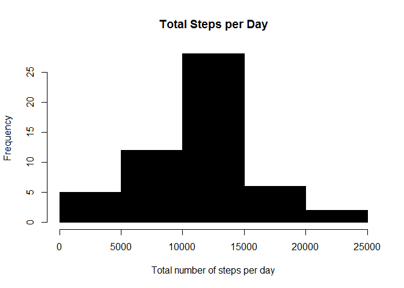
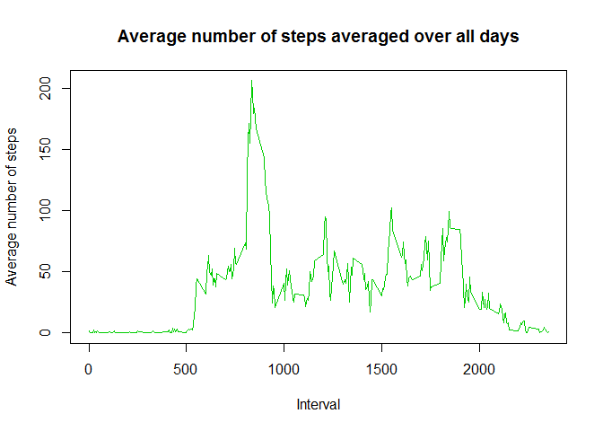
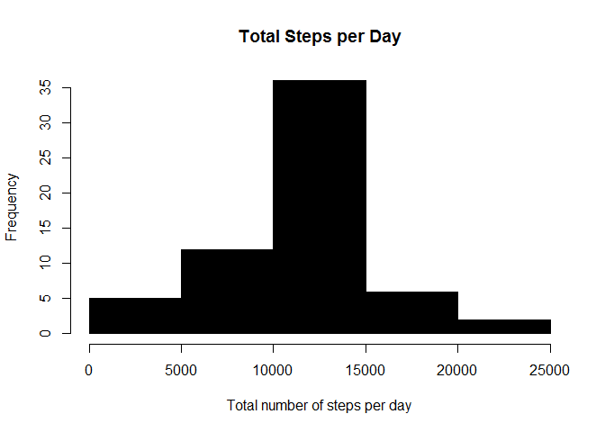
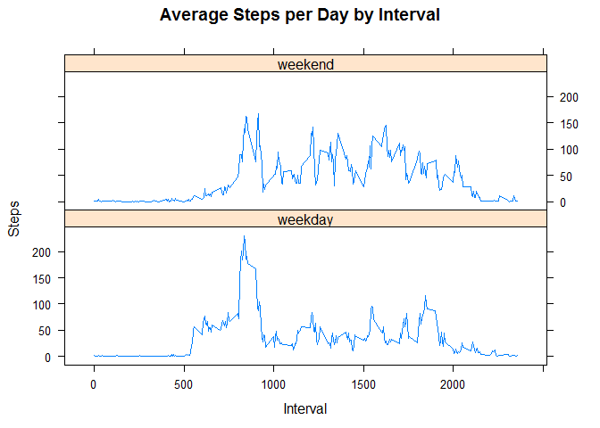

Loading and preprocessing the data
----------------------------------

1.  Load the data (i.e. read.csv())

<!-- -->

    if (!file.exists("activity.csv")) {
                    download.file("http://d396qusza40orc.cloudfront.net/repdata%2Fdata%2Factivity.zip", destfile = "activity.zip", mode="wb")
                    unzip("activity.zip")
                    unlink("activity.zip")
            write(date(), file="dateDownloaded.txt")
    }
    activity<-read.csv("activity.csv")

1.  Process/transform the data (if necessary) into a format suitable for
    your analysis Remove NA values

<!-- -->

    cleanactivity <- na.omit(activity)

Question 1:What is mean total number of steps taken per day?
------------------------------------------------------------

1.  Calculate the total number of steps taken per day

<!-- -->

    stepsbydate <- aggregate(steps ~ date, cleanactivity, sum)

1.  Make a histogram of the total number of steps taken each day

<!-- -->

    hist(stepsbydate$steps, col=1, main="Total Steps per Day", 
         xlab="Total number of steps per day")

1.  Calculate and report the mean and median of the total number of
    steps taken per day

<!-- -->

    stepsmean <- mean(stepsbydate$steps)
    stepsmedian <- median(stepsbydate$steps)

The mean and median total number of steps per day are 10766 and 10765
steps respectively.

Question 2: What is the average daily activity pattern?
-------------------------------------------------------

1.Make a time series plot (i.e. type = "l") of the 5-minute interval
(x-axis) and the average number of steps taken, average

Aggregate steps on each interval to get average number of steps in an
interval across all days

    stepsbyinterval <- aggregate(steps ~ interval, cleanactivity, mean)

    plot(stepsbyinterval$interval, stepsbyinterval$steps, type='l', col=11, 
         main="Average number of steps averaged over all days", xlab="Interval", 
         ylab="Average number of steps")

2.Which 5-minute interval, on average across all the days in the
dataset, contains the maximum number of steps?

Find row id with the maximum average number of steps in an interval

    maxstepsid <- which.max(stepsbyinterval$steps)

Get the interval with maximum average number of steps in an interval

    stepsbyinterval [maxstepsid , ]

    ##     interval    steps
    ## 104      835 206.1698

Table id 104 which is interval 835 has the maximum average number of
steps (206.2).

Question 3:Imputing missing values
----------------------------------

1.  Calculate and report the total number of missing values in the
    dataset (i.e. the total number of rows with NAs).

<!-- -->

    sum(as.numeric(is.na(activity$steps)))

    ## [1] 2304

1.  Devise a strategy for filling in all of the missing values in the
    dataset. The strategy does not need to be sophisticated. For
    example, you could use the mean/median for that day, or the mean for
    that 5-minute interval, etc.

To fill in the missing values of the dataset, my approach is to replace
the NA by the mean for that 5-minute interval. This data has already
been calculated in the data frame "stepsbyinterval".

1.  Create a new dataset that is equal to the original dataset but with
    the missing data filled in.

The new dataset is called "newvalues"

    newvalues <- transform(activity, steps = ifelse(is.na(activity$steps), 
                                            stepsbyinterval$steps[match(activity$interval, 
                                            stepsbyinterval$interval)], activity$steps))

Aggregate steps to get total number of steps in a day

    totalstepbydate <- aggregate(steps ~ date, newvalues, sum)

1.  Make a histogram of the total number of steps taken each day and
    Calculate and report the mean and median total number of steps taken
    per day.

<!-- -->

    hist(totalstepbydate$steps, col=1, main="Total Steps per Day", 
         xlab="Total number of steps per day")

Do these values differ from the estimates from the first part of the
assignment? What is the impact of imputing missing data on the estimates
of the total daily number of steps?

The mean and median total number of steps per day are both 10766
respectively. The results which include replacement values(the average
steps within interval) of missing values slightly differ from the median
results that exlcude missing values by approximately 0.01%.

Question 4: Are there differences in activity patterns between weekdays and weekends?
-------------------------------------------------------------------------------------

1.  Create a new factor variable in the dataset with two levels -
    "weekday" and "weekend" indicating whether a given date is a weekday
    or weekend day.

Convert date formats

    newvalues$date <- as.Date(newvalues$date, "%Y-%m-%d")

Add a new column indicating day of the week

    newvalues$day <- weekdays(newvalues$date)

Add a new column called day type and initialize to weekday

    newvalues$typeofday <- c("weekday")

If day is Saturday or Sunday, write typeofday as weekend

    for (i in 1:nrow(newvalues)){
            if (newvalues$day[i] == "Saturday" || newvalues$day[i] == "Sunday"){
                    newvalues$typeofday[i] <- "weekend"
            }
    }

Convert typeofday in to factor for plotting

    newvalues$typeofday <- as.factor(newvalues$typeofday)

Aggregate steps as interval to get average number of steps in an
interval across all days

    stepsbyday <- aggregate(steps ~ interval+typeofday, newvalues, mean)

1.  Make a panel plot containing a time series plot (i.e. type = "l") of
    the 5-minute interval (x-axis) and the average number of steps
    taken, averaged across all weekday days or weekend days (y-axis).
    Load lattice for plotting

<!-- -->

    library(lattice)

    xyplot(stepsbyday$steps ~ stepsbyday$interval|stepsbyday$typeofday, main="Average Steps per Day by Interval",xlab="Interval", ylab="Steps",layout=c(1,2), type="l")

